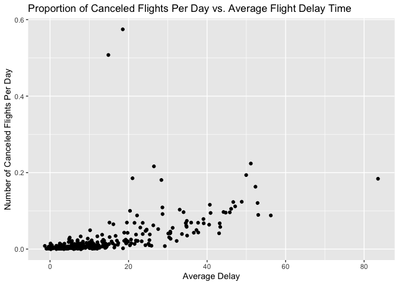

First Homework for Stat 433 Fall 2022
================
Sophia Giustino
9/20/2022

## Homework Week 3

Answer the following questions with dplyr code in RMarkdown. Post the
answer into your github as a “nice readme” as explained in class.

#### How many flights have a missing dep_time? What other variables are missing? What might these rows represent?

*How many flights have a missing dep_time?*

``` r
flights$dep_time %>% is.na() %>% sum()
```

    ## [1] 8255

8255 flights have a missing dep_time.

*What other variables are missing?*

``` r
flights %>% filter(is.na(dep_time)) %>% head()
```

    ## # A tibble: 6 × 19
    ##    year month   day dep_time sched_dep_time dep_delay arr_time sched_arr_time
    ##   <int> <int> <int>    <int>          <int>     <dbl>    <int>          <int>
    ## 1  2013     1     1       NA           1630        NA       NA           1815
    ## 2  2013     1     1       NA           1935        NA       NA           2240
    ## 3  2013     1     1       NA           1500        NA       NA           1825
    ## 4  2013     1     1       NA            600        NA       NA            901
    ## 5  2013     1     2       NA           1540        NA       NA           1747
    ## 6  2013     1     2       NA           1620        NA       NA           1746
    ## # … with 11 more variables: arr_delay <dbl>, carrier <chr>, flight <int>,
    ## #   tailnum <chr>, origin <chr>, dest <chr>, air_time <dbl>, distance <dbl>,
    ## #   hour <dbl>, minute <dbl>, time_hour <dttm>

``` r
names(which(colSums(is.na(flights))>=8255))
```

    ## [1] "dep_time"  "dep_delay" "arr_time"  "arr_delay" "air_time"

The other missing variables are dep_delay, arr_time, arr_delay, and
air_time.

*What might these rows represent?*

These rows might represent cancelled flights because they have scheduled
times but they never depart or arrive or have a calculated air time, so
it is possible the flights did not actually occur.

#### Currently dep_time and sched_dep_time are convenient to look at, but hard to compute with because they’re not really continuous numbers. Convert them to a more convenient representation of number of minutes since midnight.

``` r
hr_con <- function(x){(x %/% 100) * 60}


flights = flights %>% 
  mutate(dep_time = hr_con(dep_time) + (dep_time %% 100), 
         sched_dep_time = hr_con(sched_dep_time) + (sched_dep_time %% 100)) 
flights %>% head()
```

    ## # A tibble: 6 × 19
    ##    year month   day dep_time sched_dep_time dep_delay arr_time sched_arr_time
    ##   <int> <int> <int>    <dbl>          <dbl>     <dbl>    <int>          <int>
    ## 1  2013     1     1      317            315         2      830            819
    ## 2  2013     1     1      333            329         4      850            830
    ## 3  2013     1     1      342            340         2      923            850
    ## 4  2013     1     1      344            345        -1     1004           1022
    ## 5  2013     1     1      354            360        -6      812            837
    ## 6  2013     1     1      354            358        -4      740            728
    ## # … with 11 more variables: arr_delay <dbl>, carrier <chr>, flight <int>,
    ## #   tailnum <chr>, origin <chr>, dest <chr>, air_time <dbl>, distance <dbl>,
    ## #   hour <dbl>, minute <dbl>, time_hour <dttm>

#### Look at the number of canceled flights per day. Is there a pattern? Is the proportion of canceled flights related to the average delay? Use multiple dyplr operations, all on one line, concluding with ggplot(aes(x= ,y=)) + geom_point()

``` r
flights %>% 
  mutate(cancel = is.na(dep_time)) %>% 
  group_by(month, day) %>% 
  summarise(num_flights = n(), prop_canc = sum(cancel)/num_flights, avg_delay = mean(dep_delay, na.rm = TRUE)) %>% 
  ggplot(aes(x= avg_delay, y = prop_canc)) +
  ylab("Number of Canceled Flights Per Day") +
  xlab("Average Delay") +
  ggtitle("Proportion of Canceled Flights Per Day vs. Average Flight Delay Time") +
  geom_point() 
```

    ## `summarise()` has grouped output by 'month'. You can override using the
    ## `.groups` argument.

<!-- -->

There is a pattern in the number of canceled flights per day. The
proportion of canceled flights is related to the average delay. As we
can see in the plot, the longer the daily average delay time is, the
higher the proportion of canceled flights there are in the day.
